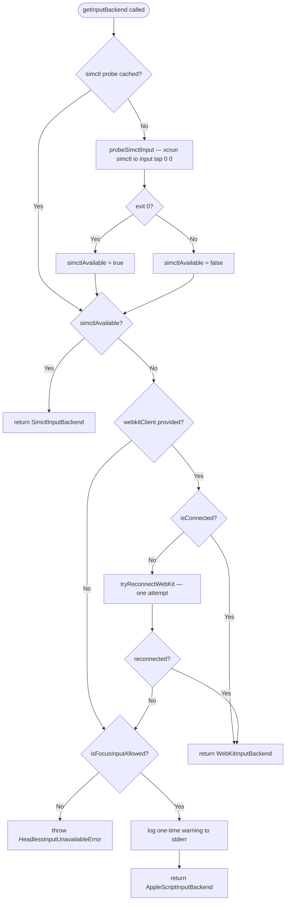

# Headless Architecture

This document describes how OpenSafari achieves headless iOS automation — no mouse
stealing, no `Simulator.app` window focus, CI-clean — and how it selects the right
input backend for each situation.

---

## 1. Overview

OpenSafari is a headless mobile QA automation tool. It drives Safari and native iOS
apps running inside Xcode Simulator via WebKit Remote Debugging Protocol and the
Accessibility framework. "Headless" means:

- **No mouse-cursor movement** — the physical cursor stays where it is.
- **No Simulator.app activation** — CI agents do not steal focus from other
  processes.
- **No screen required** — all interaction happens over TCP sockets and IPC
  channels, so the tool runs equally well in a headless CI VM.

These guarantees are enforced by the input-backend tier system. The non-headless
`AppleScriptInputBackend` path is default-deny and requires an explicit opt-in.

---

## 2. Input Backend Tier Routing

Native input tools (`app_tap`, `app_swipe_native`, `app_scroll_native`,
`app_double_tap`, `app_type_text`, `app_key_input`) are dispatched through a
3-tier fallback chain defined in `src/tools/native-input-backend.ts`.

### Routing table

| Tier | Backend | `kind` | Headless | Selection Condition | Status |
|------|---------|--------|----------|---------------------|--------|
| 1 | `SimctlInputBackend` | `simctl` | Yes | `xcrun simctl io input` probe succeeds (Xcode ≤ 16) | Production |
| 2 | `WebKitInputBackend` | `webkit` | Yes | Active or reconnectable WebKit connection present (Xcode 26+, Safari/WebView only) | Production |
| 3 | `AppleScriptInputBackend` | `applescript` | **No** | Opt-in only (`OPENSAFARI_ALLOW_FOCUS_INPUT=1`); throws `HeadlessInputUnavailableError` otherwise | Legacy/opt-in |

A fourth backend (`SimulatorKitHIDInputBackend`, `kind: 'simhid'`) is shipped in
`src/tools/sim-hid-input-backend.ts` as a PoC. It is **not yet wired into
`getInputBackend()`** — see the `TODO(#483)` comment in the source. When activated
it is intended to replace Tier 1 and provide headless HID events for any app type
on all Xcode versions.

### Decision flowchart



The simctl probe result is **cached for the process lifetime**. WebKit connection
state is checked on every call because a Safari tab can be closed and reopened
between tool calls.

---

## 3. Scenario Matrix

| Scenario | Query (AX) | Input | Headless | Backend Used | Notes |
|----------|-----------|-------|----------|--------------|-------|
| Safari web automation (Xcode ≤ 16) | WebKit Protocol | `simctl` | Yes | `SimctlInputBackend` | Default for Xcode 15 / 16 |
| Safari web automation (Xcode 26+) | WebKit Protocol | `webkit` | Yes | `WebKitInputBackend` | `simctl io input` was removed in Xcode 26 |
| Flutter app (Xcode ≤ 16) | AX bridge (`ax-bridge`) | `simctl` | Yes | `SimctlInputBackend` | Flutter semantics must be active |
| Flutter app (Xcode 26+, no simhid) | AX bridge | — | **No** | Throws `HeadlessInputUnavailableError` unless `OPENSAFARI_ALLOW_FOCUS_INPUT=1` | simhid PoC targets this gap (#483) |
| Native iOS / SwiftUI app (Xcode ≤ 16) | AX bridge | `simctl` | Yes | `SimctlInputBackend` | Works for any app |
| Native iOS / SwiftUI app (Xcode 26+, no simhid) | AX bridge | — | **No** | Throws `HeadlessInputUnavailableError` | Same gap as Flutter above |
| WebView inside native app | AX bridge + WebKit | `webkit` | Yes | `WebKitInputBackend` via `app_webview_connect` | Requires an active WebKit connection |
| GUI-less CI (no display, Xcode 26+, Safari) | WebKit Protocol | `webkit` | Yes | `WebKitInputBackend` | Fully headless; recommended CI setup |

---

## 4. Backend Details

### SimctlInputBackend (`kind: 'simctl'`)

Uses `xcrun simctl io <deviceId> input <subcommand>` to inject touch and swipe
events. Works for any app type (Safari, Flutter, native UIKit/SwiftUI). Available
on Xcode versions that ship the `input` subcommand — Apple removed it in Xcode 26.

On every new process the backend executes a probe tap at `(0, 0)` against the
first requested device. If the probe succeeds, `simctlAvailable` is cached `true`
for the process lifetime; otherwise `false`. A cached `SimctlInputBackend` instance
is reused for all subsequent calls.

Status: **Production** (default Tier 1 on Xcode ≤ 16).

### SimulatorKitHIDInputBackend (`kind: 'simhid'`)

Spawns the `sim-hid-bridge` Swift helper as a short-lived child process. The bridge
uses `dlopen` to load `SimulatorKit.framework` and `CoreSimulator.framework` at
runtime (never link-time), resolves a booted `SimDevice` from the UDID, then
injects HID events directly via the private `SimulatorKit` API — the same technique
used by Facebook's `idb` (MIT). All private-symbol resolution is confined to the
Swift bridge; the TypeScript side treats the bridge as an opaque child process.

The bridge communicates exclusively via argv (command) and newline-terminated JSON
on stdout. Exit codes are a stable contract (see `docs/private-apis.md`).

The current Swift implementation exits `99 NOT_IMPLEMENTED` — the PoC proves the
`dlopen` path works, but the actual HID injection is not yet shipped. Routing
activation and the sentinel CI job land in follow-up PRs.

Status: **PoC** — not yet wired into `getInputBackend()`. Tracked in
[#483](https://github.com/shaun0927/opensafari/issues/483).

### WebKitInputBackend (`kind: 'webkit'`)

Injects touch events as JavaScript via WebKit Remote Debugging Protocol (the same
TCP socket used for navigation and screenshots). Operates entirely over the socket —
no window focus, no cursor movement. Limitations:

- Only works when Safari or a WebView is connected via the WebKit protocol.
- Touch events dispatched via JS have `isTrusted: false`, so scroll is supplemented
  with an explicit `window.scrollBy()` call.
- Tap is delegated to `BrowserBackend.click()`, which dispatches `touchstart →
  touchend → click` with `emulateUserGesture: true`.

If the client exists but reports `isConnected() === false`, `getInputBackend()`
makes one reconnect attempt before falling through to Tier 3. This tolerates
transient drops caused by proxy restarts or tab churn.

Status: **Production** (Tier 2; becomes the primary tier on Xcode 26+).

### AppleScriptInputBackend (`kind: 'applescript'`)

Uses `osascript` to activate `Simulator.app` and synthesise CGEvent mouse events
(via inline `swift -e` for taps and drags). This is the only backend that is **not
headless**: it moves the physical mouse cursor, brings the Simulator window to the
foreground, and cannot run in a CI environment without a display.

Because of these side-effects the backend is **default-deny**: `getInputBackend()`
throws `HeadlessInputUnavailableError` instead of silently returning this backend.
It is only instantiated when `OPENSAFARI_ALLOW_FOCUS_INPUT=1` is set, and a
one-time warning is logged to `stderr` at the first tool call.

Status: **Legacy opt-in only**.

### FlutterVMInputBackend (planned)

A planned backend that would inject touch events by sending `PointerDataPacket`
messages directly to the Dart VM Service running inside the Flutter engine. This
path would be fully headless and would work for Flutter apps without requiring the
`simctl io input` subcommand or a WebKit connection.

Status: **Not yet implemented**. Tracked in
[#484](https://github.com/shaun0927/opensafari/issues/484).

---

## 5. Environment Variables

| Variable | Default | Description |
|----------|---------|-------------|
| `OPENSAFARI_ALLOW_FOCUS_INPUT` | unset (deny) | Set to `1` or `true` to enable `AppleScriptInputBackend`. **Will move the physical mouse cursor and activate `Simulator.app`.** Accepted values: `1`, `true`; anything else is ignored. A one-time warning is logged to `stderr` at the first use. |
| `OPENSAFARI_ALLOW_SWIFT_INTERPRETER` | unset (deny) | Set to `1` to include the `src/native/sim-hid-bridge.swift` source-tree path in the `tryCreateSimulatorKitHIDBackend()` candidate list. Development-only; skipped in production installs because the repo-relative path escapes `dist/` and executing unsigned Swift source sidesteps future codesigning. |
| `OPENSAFARI_PROXY_PORT` | `9322` | WebKit debug proxy port. Overrides the default port used by `ios_webkit_debug_proxy`. Port resolution order: explicit `port` option → `OPENSAFARI_PROXY_PORT` → `9322`. |

---

## 6. Error Handling

### `HeadlessInputUnavailableError`

Thrown by `getInputBackend()` when no headless input method is available and the
caller has not opted in to the focus-stealing fallback.

```typescript
export class HeadlessInputUnavailableError extends Error {
  readonly name = 'HeadlessInputUnavailableError';
  readonly deviceId: string;          // Simulator UDID
  readonly reason: 'no-simctl' | 'no-webkit' | 'webkit-disconnected';
  readonly remediation: readonly string[];
}
```

**Fields:**

- `deviceId` — the Simulator UDID that was passed to `getInputBackend()`.
- `reason` — machine-readable cause:
  - `no-webkit` — no `webkitClient` was supplied (caller did not open Safari/WebView).
  - `webkit-disconnected` — a client was supplied but failed to reconnect.
- `remediation` — ordered list of actionable suggestions surfaced in the error
  message and available for structured handling by MCP clients:
  1. For Safari QA: call `set_active_context({ context: 'safari' })` to enable
     `WebKitInputBackend`.
  2. For native apps: set `OPENSAFARI_ALLOW_FOCUS_INPUT=1` (with the documented
     side-effects).

**When it is thrown:**

`getInputBackend()` throws this error when all three conditions hold:
1. `simctlAvailable` is `false` (Xcode 26+ where `simctl io input` was removed).
2. No usable WebKit connection is available (either none provided, or reconnect
   failed).
3. `OPENSAFARI_ALLOW_FOCUS_INPUT` is not set to `1` or `true`.

**How to handle it:**

```typescript
import { HeadlessInputUnavailableError } from './native-input-backend';

try {
  const backend = await getInputBackend(deviceId, webkitClient);
  await backend.tap(deviceId, x, y);
} catch (err) {
  if (err instanceof HeadlessInputUnavailableError) {
    // err.reason tells you exactly which headless path was unavailable.
    // err.remediation contains human-readable steps for the user.
    console.error('[my-tool] headless input unavailable:', err.remediation.join(' | '));
    // Re-throw or surface to MCP caller — do NOT silently fall back to
    // AppleScript without user consent.
    throw err;
  }
  throw err;
}
```

---

## 7. Private API Policy

The `SimulatorKitHIDInputBackend` path uses two private Apple frameworks:
`SimulatorKit.framework` and `CoreSimulator.framework`. Full details are documented
in [`docs/private-apis.md`](private-apis.md).

Key policies:

- **Runtime-only loading via `dlopen`** — no link-time dependency on private
  frameworks. Missing or broken frameworks surface as a structured
  `InputBackendError` with `code: 'SIMULATORKIT_UNAVAILABLE'` rather than a dyld
  crash.
- **Fallback tiers stay wired** — activating `SimulatorKitHIDInputBackend` will
  not remove `SimctlInputBackend`, `WebKitInputBackend`, or
  `AppleScriptInputBackend`. If the private-framework path breaks (exit code `78`
  or `99`), `getInputBackend()` drops to the next tier automatically.
- **Sentinel CI job (planned)** — a nightly workflow will run a smoke-tap against a
  matrix of (macOS, Xcode) runners. A regression on any previously-passing version
  fails loudly while existing tiers continue serving users.
- **Update obligation** — any PR that adds or removes a private-symbol dependency
  must update `docs/private-apis.md` in the same change. Reviewers block merges
  that skip this step.

When Apple breaks a private API in a new Xcode release, the recommended response is:

1. The sentinel CI job fires immediately on the affected (macOS, Xcode) combination.
2. The routing layer falls through to `WebKitInputBackend` or the opt-in
   AppleScript path, keeping existing users unblocked.
3. A follow-up PR updates the Swift bridge to adapt to the new symbol layout.

---

## 8. References

### Related source files

- `src/tools/native-input-backend.ts` — `getInputBackend()`, `InputBackendKind`,
  `HeadlessInputUnavailableError`, `isFocusInputAllowed()`,
  `SimctlInputBackend`, `WebKitInputBackend`, `AppleScriptInputBackend`
- `src/tools/sim-hid-input-backend.ts` — `SimulatorKitHIDInputBackend`,
  `tryCreateSimulatorKitHIDBackend()`, `InputBackendError`
- `src/native/sim-hid-bridge.swift` — Swift bridge that `dlopen`s
  `SimulatorKit.framework` and runs HID injection
- `docs/private-apis.md` — private framework contract, exit-code table, BC-break
  monitoring strategy

### Related issues

| Issue | Topic |
|-------|-------|
| [#481](https://github.com/shaun0927/opensafari/issues/481) | Remove `simctl io input` dependency for Xcode 26 compatibility |
| [#483](https://github.com/shaun0927/opensafari/issues/483) | `SimulatorKitHIDInputBackend` PoC — private HID injection via `SimulatorKit.framework` |
| [#484](https://github.com/shaun0927/opensafari/issues/484) | `FlutterVMInputBackend` — headless input via Dart VM Service `PointerDataPacket` |
| [#496](https://github.com/shaun0927/opensafari/issues/496) | This document |
