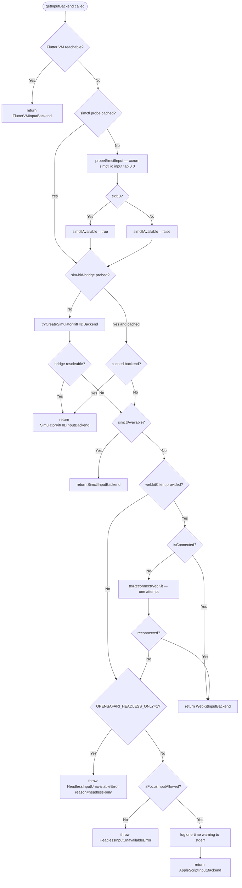

# Headless Architecture

This document describes how OpenSafari achieves headless iOS automation — no mouse
stealing, no `Simulator.app` window focus, CI-clean — and how it selects the right
input backend for each situation.

---

## 1. Overview

OpenSafari is a headless mobile QA automation tool. It drives Safari and native iOS
apps running inside Xcode Simulator via WebKit Remote Debugging Protocol and the
Accessibility framework. "Headless" means:

- **No mouse-cursor movement** — the physical cursor stays where it is.
- **No Simulator.app activation** — CI agents do not steal focus from other
  processes.
- **No screen required** — all interaction happens over TCP sockets and IPC
  channels, so the tool runs equally well in a headless CI VM.

These guarantees are enforced by the input-backend tier system. The non-headless
`AppleScriptInputBackend` path is default-deny and requires an explicit opt-in.

---

## 2. Input Backend Tier Routing

Native input tools (`app_tap`, `app_swipe_native`, `app_scroll_native`,
`app_double_tap`, `app_type_text`, `app_key_input`) are dispatched through a
5-tier fallback chain defined in `src/tools/native-input-backend.ts`.

### Routing table

| Tier | Backend | `kind` | Target apps | Headless | Xcode 26+ | Selection Condition | Status |
|------|---------|--------|-------------|----------|-----------|---------------------|--------|
| 0 | `FlutterVMInputBackend` | `flutter-vm` | Flutter only | Yes | Yes | Flutter VM Service reachable within 1.5 s discovery timeout | Production |
| 1 | `SimulatorKitHIDInputBackend` | `simhid` | Any app | Yes | Yes | `sim-hid-bridge` binary resolves and `SimulatorKit.framework` loads via `dlopen` | Production |
| 2 | `SimctlInputBackend` | `simctl` | Any app | Yes | **Removed** | `xcrun simctl io input` probe succeeds (Xcode ≤ 16) | Legacy |
| 3 | `WebKitInputBackend` | `webkit` | Safari / WebView | Yes | Yes | Active or reconnectable WebKit connection present | Production |
| 4 | `AppleScriptInputBackend` | `applescript` | Any app | **No** | Yes | Opt-in only (`OPENSAFARI_ALLOW_FOCUS_INPUT=1`); throws `HeadlessInputUnavailableError` otherwise | Legacy / opt-in |

Tier 0 (`FlutterVMInputBackend`) ships production-ready for Flutter apps
launched under `flutter run` with the Dart VM Service (and DDS) enabled.
Tier 1 (`SimulatorKitHIDInputBackend`) closed the native-app gap introduced
when Apple removed `simctl io input` in Xcode 26: the Swift bridge `dlopen`s
`SimulatorKit.framework` at runtime and injects real `IOHIDEvent`s, so
Simulator.app can stay backgrounded and the physical mouse cursor does not
move. See [`docs/private-apis.md`](private-apis.md) for the private-framework
contract.

### Decision flowchart



The simctl probe result and the sim-hid-bridge lookup result are both
**cached for the process lifetime**. WebKit connection state is checked on
every call because a Safari tab can be closed and reopened between tool
calls. Flutter VM discovery has a per-device 30 s negative cache so native
iOS apps do not pay the discovery cost on every call.

---

## 3. Scenario Matrix

| Scenario | Query (AX) | Input | Headless | Backend Used | Notes |
|----------|-----------|-------|----------|--------------|-------|
| Safari web automation (Xcode ≤ 16) | WebKit Protocol | `simctl` | Yes | `SimctlInputBackend` | Default Tier 2 for Xcode 15 / 16 |
| Safari web automation (Xcode 26+) | WebKit Protocol | `webkit` | Yes | `WebKitInputBackend` | `simctl io input` was removed in Xcode 26 |
| Flutter app (debug / profile build, `flutter run`) | AX bridge (`ax-bridge`) | `flutter-vm` | Yes | `FlutterVMInputBackend` | Requires Dart VM Service + DDS reachable |
| Flutter app (release build or no VM Service) | AX bridge | `simhid` | Yes | `SimulatorKitHIDInputBackend` | Falls through Tier 0 → Tier 1 |
| Native iOS / SwiftUI app (Xcode ≤ 16) | AX bridge | `simhid` or `simctl` | Yes | Tier 1 preferred, Tier 2 fallback | Tier 1 works on every Xcode version |
| Native iOS / SwiftUI app (Xcode 26+) | AX bridge | `simhid` | Yes | `SimulatorKitHIDInputBackend` | Fills the gap left by removed `simctl io input` |
| WebView inside native app | AX bridge + WebKit | `webkit` | Yes | `WebKitInputBackend` via `app_webview_connect` | Requires an active WebKit connection |
| GUI-less CI (no display, Xcode 26+, native) | AX bridge | `simhid` | Yes | `SimulatorKitHIDInputBackend` | Fully headless; Simulator.app can be backgrounded |
| GUI-less CI (no display, Xcode 26+, Safari) | WebKit Protocol | `webkit` | Yes | `WebKitInputBackend` | Fully headless; recommended CI setup |

---

## 4. Backend Details

### SimctlInputBackend (`kind: 'simctl'`)

Uses `xcrun simctl io <deviceId> input <subcommand>` to inject touch and swipe
events. Works for any app type (Safari, Flutter, native UIKit/SwiftUI). Available
on Xcode versions that ship the `input` subcommand — Apple removed it in Xcode 26.

On every new process the backend executes a probe tap at `(0, 0)` against the
first requested device. If the probe succeeds, `simctlAvailable` is cached `true`
for the process lifetime; otherwise `false`. A cached `SimctlInputBackend` instance
is reused for all subsequent calls.

Status: **Production** (default Tier 1 on Xcode ≤ 16).

### SimulatorKitHIDInputBackend (`kind: 'simhid'`)

Spawns the `sim-hid-bridge` Swift helper as a short-lived child process. The bridge
uses `dlopen` to load `SimulatorKit.framework` and `CoreSimulator.framework` at
runtime (never link-time), resolves a booted `SimDevice` from the UDID, then
injects real `IOHIDEvent`s via the private `SimDeviceLegacyHIDClient` and
`IndigoHIDMessage*` C functions — the same technique used by Facebook's `idb`
(MIT). All private-symbol resolution is confined to the Swift bridge; the
TypeScript side treats the bridge as an opaque child process.

The bridge communicates exclusively via argv (command) and newline-terminated JSON
on stdout. Exit codes are a stable contract:

| Exit | Meaning | TypeScript code |
|------|---------|-----------------|
| 0 | success | n/a |
| 64 | usage / bad args | `BAD_ARGS` |
| 69 | `SimDevice` not booted | `DEVICE_NOT_BOOTED` |
| 78 | `SimulatorKit.framework` (or HID symbols) missing | `SIMULATORKIT_UNAVAILABLE` |

See [`docs/private-apis.md`](private-apis.md) for the full symbol manifest, the
BC-break monitoring strategy, and the policy contract with reviewers.

Status: **Production** (Tier 1). Activated in
[#490](https://github.com/shaun0927/opensafari/pull/511). Native iOS app taps,
swipes, key presses, and hardware button synthesis are now fully headless on
Xcode 26+ where `simctl io input` was removed.

### WebKitInputBackend (`kind: 'webkit'`)

Injects touch events as JavaScript via WebKit Remote Debugging Protocol (the same
TCP socket used for navigation and screenshots). Operates entirely over the socket —
no window focus, no cursor movement. Limitations:

- Only works when Safari or a WebView is connected via the WebKit protocol.
- Touch events dispatched via JS have `isTrusted: false`, so scroll is supplemented
  with an explicit `window.scrollBy()` call.
- Tap is delegated to `BrowserBackend.click()`, which dispatches `touchstart →
  touchend → click` with `emulateUserGesture: true`.

If the client exists but reports `isConnected() === false`, `getInputBackend()`
makes one reconnect attempt before falling through to Tier 3. This tolerates
transient drops caused by proxy restarts or tab churn.

Status: **Production** (Tier 2; becomes the primary tier on Xcode 26+).

### AppleScriptInputBackend (`kind: 'applescript'`)

Uses `osascript` to activate `Simulator.app` and synthesise CGEvent mouse events
(via inline `swift -e` for taps and drags). This is the only backend that is **not
headless**: it moves the physical mouse cursor, brings the Simulator window to the
foreground, and cannot run in a CI environment without a display.

Because of these side-effects the backend is **default-deny**: `getInputBackend()`
throws `HeadlessInputUnavailableError` instead of silently returning this backend.
It is only instantiated when `OPENSAFARI_ALLOW_FOCUS_INPUT=1` is set, and a
one-time warning is logged to `stderr` at the first tool call.

Status: **Legacy opt-in only**.

### FlutterVMInputBackend (`kind: 'flutter-vm'`)

Injects touch events by sending synthesized `PointerDataPacket` messages,
platform `TextInput.updateEditingState` messages, and `HardwareKeyboard` events
through the Dart VM Service running inside the Flutter engine — no CGEvent
synthesis, no Simulator.app foregrounding, no HID bridge required. Each
operation is dispatched via a library-scoped `evaluate` so the required Dart
symbols (`PlatformDispatcher`, `PointerDataPacket`, `EditableTextState`,
`HardwareKeyboard`, `LogicalKeyboardKey`) are in lexical scope.

The backend requires that the Flutter app was launched via `flutter run` (in
debug or profile mode) so both the Dart VM Service and the Dart Development
Service (DDS) are available — apps launched with `xcrun simctl launch` expose
the socket but lack the compilation service needed for `evaluate`.

A 1.5 s discovery probe bounds the cost of detecting a Flutter VM, and a
per-device 30 s negative cache prevents native iOS apps from paying repeated
probe latency.

Status: **Production** (Tier 0). Shipped in
[#481 / #486](https://github.com/shaun0927/opensafari/pull/486).

---

## 5. Environment Variables

| Variable | Default | Description |
|----------|---------|-------------|
| `OPENSAFARI_ALLOW_FOCUS_INPUT` | unset (deny) | Set to `1` or `true` to enable `AppleScriptInputBackend`. **Will move the physical mouse cursor and activate `Simulator.app`.** Accepted values: `1`, `true`; anything else is ignored. A one-time warning is logged to `stderr` at the first use. |
| `OPENSAFARI_HEADLESS_ONLY` | unset | Set to `1` or `true` to block the `AppleScriptInputBackend` fallback even when `OPENSAFARI_ALLOW_FOCUS_INPUT` is also set. Recommended for CI — `getInputBackend()` throws `HeadlessInputUnavailableError` with `reason: 'headless-only'` instead of ever returning the focus-stealing backend. Overrides `ALLOW_FOCUS_INPUT` with a warning log when both are set. |
| `OPENSAFARI_ALLOW_SWIFT_INTERPRETER` | unset (deny) | Set to `1` to include the `src/native/sim-hid-bridge.swift` source-tree path in the `tryCreateSimulatorKitHIDBackend()` candidate list. Development-only; skipped in production installs because the repo-relative path escapes `dist/` and executing unsigned Swift source sidesteps future codesigning. |
| `OPENSAFARI_PROXY_PORT` | `9322` | WebKit debug proxy port. Overrides the default port used by `ios_webkit_debug_proxy`. Port resolution order: explicit `port` option → `OPENSAFARI_PROXY_PORT` → `9322`. |

---

## 6. Error Handling

### `HeadlessInputUnavailableError`

Thrown by `getInputBackend()` when no headless input method is available and the
caller has not opted in to the focus-stealing fallback.

```typescript
export class HeadlessInputUnavailableError extends Error {
  readonly name = 'HeadlessInputUnavailableError';
  readonly deviceId: string;          // Simulator UDID
  readonly reason:
    | 'no-simctl'
    | 'no-webkit'
    | 'webkit-disconnected'
    | 'headless-only';
  readonly remediation: readonly string[];
}
```

**Fields:**

- `deviceId` — the Simulator UDID that was passed to `getInputBackend()`.
- `reason` — machine-readable cause:
  - `no-simctl` — `simctl io input` was removed (Xcode 26+) and no higher tier
    matched.
  - `no-webkit` — no `webkitClient` was supplied (caller did not open
    Safari / WebView) after Tier 0 and Tier 1 declined.
  - `webkit-disconnected` — a WebKit client was supplied but failed to reconnect.
  - `headless-only` — `OPENSAFARI_HEADLESS_ONLY=1` blocked the opt-in
    `AppleScriptInputBackend` fallback even though `OPENSAFARI_ALLOW_FOCUS_INPUT`
    was set.
- `remediation` — ordered list of actionable suggestions surfaced in the error
  message and available for structured handling by MCP clients:
  1. For Safari QA: call `set_active_context({ context: 'safari' })` to enable
     `WebKitInputBackend`.
  2. For native apps on Xcode 26+: install `sim-hid-bridge` (ships with
     `npm install opensafari-mcp` — verify with `diagnose`).
  3. As a last resort: set `OPENSAFARI_ALLOW_FOCUS_INPUT=1` (with the documented
     side-effects) and ensure `OPENSAFARI_HEADLESS_ONLY` is not set.

**When it is thrown:**

`getInputBackend()` throws this error when every tier declines:
1. No Flutter VM is reachable on the device (Tier 0 skipped).
2. `sim-hid-bridge` is not present or `SimulatorKit.framework` could not be
   loaded (Tier 1 skipped).
3. `simctlAvailable` is `false` — Xcode 26+ where `simctl io input` was removed
   (Tier 2 skipped).
4. No usable WebKit connection is available (Tier 3 skipped).
5. `OPENSAFARI_ALLOW_FOCUS_INPUT` is unset OR `OPENSAFARI_HEADLESS_ONLY` is set
   (Tier 4 blocked).

**How to handle it:**

```typescript
import { HeadlessInputUnavailableError } from './native-input-backend';

try {
  const backend = await getInputBackend(deviceId, webkitClient);
  await backend.tap(deviceId, x, y);
} catch (err) {
  if (err instanceof HeadlessInputUnavailableError) {
    // err.reason tells you exactly which headless path was unavailable.
    // err.remediation contains human-readable steps for the user.
    console.error('[my-tool] headless input unavailable:', err.remediation.join(' | '));
    // Re-throw or surface to MCP caller — do NOT silently fall back to
    // AppleScript without user consent.
    throw err;
  }
  throw err;
}
```

---

## 7. Private API Policy

The `SimulatorKitHIDInputBackend` path uses two private Apple frameworks:
`SimulatorKit.framework` and `CoreSimulator.framework`. Full details are documented
in [`docs/private-apis.md`](private-apis.md).

Key policies:

- **Runtime-only loading via `dlopen`** — no link-time dependency on private
  frameworks. Missing or broken frameworks surface as a structured
  `InputBackendError` with `code: 'SIMULATORKIT_UNAVAILABLE'` rather than a dyld
  crash.
- **Fallback tiers stay wired** — activating `SimulatorKitHIDInputBackend` will
  not remove `SimctlInputBackend`, `WebKitInputBackend`, or
  `AppleScriptInputBackend`. If the private-framework path breaks (exit code `78`
  or `99`), `getInputBackend()` drops to the next tier automatically.
- **Sentinel CI job** — `tests/ci/sim-hid-sentinel.test.ts` probes framework
  availability and symbol resolution on a daily cron (see
  `.github/workflows/sim-hid-sentinel.yml`). A regression on any previously-passing
  (macOS, Xcode) combination fails loudly while existing tiers continue serving
  users.
- **Update obligation** — any PR that adds or removes a private-symbol dependency
  must update `docs/private-apis.md` in the same change. Reviewers block merges
  that skip this step.

When Apple breaks a private API in a new Xcode release, the recommended response is:

1. The sentinel CI job fires immediately on the affected (macOS, Xcode) combination.
2. The routing layer falls through to `WebKitInputBackend` or the opt-in
   AppleScript path, keeping existing users unblocked.
3. A follow-up PR updates the Swift bridge to adapt to the new symbol layout.

---

## 8. References

### Related source files

- `src/tools/native-input-backend.ts` — `getInputBackend()`, `InputBackendKind`,
  `HeadlessInputUnavailableError`, `isFocusInputAllowed()`,
  `SimctlInputBackend`, `WebKitInputBackend`, `AppleScriptInputBackend`
- `src/tools/sim-hid-input-backend.ts` — `SimulatorKitHIDInputBackend`,
  `tryCreateSimulatorKitHIDBackend()`, `InputBackendError`
- `src/native/sim-hid-bridge.swift` — Swift bridge that `dlopen`s
  `SimulatorKit.framework` and runs HID injection
- `docs/private-apis.md` — private framework contract, exit-code table, BC-break
  monitoring strategy

### Related issues

| Issue | Topic |
|-------|-------|
| [#481](https://github.com/shaun0927/opensafari/issues/481) | Remove `simctl io input` dependency for Xcode 26 compatibility |
| [#483](https://github.com/shaun0927/opensafari/issues/483) | `SimulatorKitHIDInputBackend` PoC — private HID injection via `SimulatorKit.framework` |
| [#484](https://github.com/shaun0927/opensafari/issues/484) | `FlutterVMInputBackend` — headless input via Dart VM Service `PointerDataPacket` |
| [#496](https://github.com/shaun0927/opensafari/issues/496) | This document |
